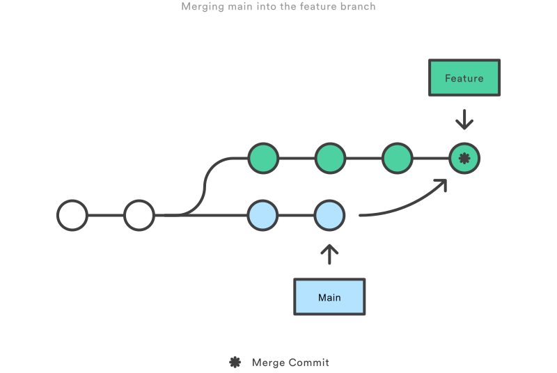

If you are like me, you've looked up what `git rebase` does at least once a month and never seem to fully understand its might and glory; you only occasionally use the command when it's suggested by none other but git itself, when you try to push a foxtrot commit to a remote branch and got rejected. Then you realized you just recently opened your personal blog, and this seems like a light-hearted enough topic to be the first official post. So here goes.

### The 2 Modes of git rebase
People generally use git rebase for 2 purposes. (1) to clean up their local commit history and (2) to bring in changes from their base branch (typically `main` or `master`) into their feature branch since they've started working on the branch. 

The first usecase sounds endlessly enticing. Our CI/CD pipeline has a build step that broudcasts a commit history to the entire tech team on master merge into a central monorepo, and there are countless times where I wished I had been more careful with my commit messages. Chances are, when you merge in a large enough feature branch, they are polluted with fixup commits tagged `Oops` and `Oops again`, and distract your collaborators from the core of your feature. In these cases, a local rebase comes to rescue.
```git
git rebase -i HEAD~3
```
This command will bring up a history of 3 most recent commits (from current `HEAD`) in an editor screen that looks something like this:
```git
pick 76f3f90 feature commit
pick d001552 oops, bugfix
pick 5aaba29 oops, another bugfix
# Rebase 7886e9f..5aaba29 onto 7886e9f (3 commands)
#
# Commands:
# p, pick <commit> = use commit
# r, reword <commit> = use commit, but edit the commit message
# e, edit <commit> = use commit, but stop for amending
# s, squash <commit> = use commit, but meld into previous commit
# f, fixup [-C | -c] <commit> = like "squash" but keep only the previous
#                    commit's log message, unless -C is used, in which case
#                    keep only this commit's message; -c is same as -C but
#                    opens the editor
# x, exec <command> = run command (the rest of the line) using shell
# b, break = stop here (continue rebase later with 'git rebase --continue')
# d, drop <commit> = remove commit
```
Say you only want to keep the first commit / message, but want to obviously keep the contents of your consecutive bugfixes, you can simply modify the command for the last 2 commits from `pick` to `fixup`. It is worth noting that this usecase is completely local to yourself, you are simply tidying up a feature branch without interacting with the remote.

Another mode of usage involves bringing changes from a remote base branch to get your feature branch ready for a Pull Request. Wait, doesn't git merge does that? Yes, but in slightly different ways. Merge preserves the entire commit history by explicitly creating a new "merge" commit merging main into master. In doing so, the branch structure would be non-linear:


Whereas for rebase, it will move all commits from your feature branch and put them on the tip of the latest base branch (hence the name rebase), and in doing so, creating a linear branch structure with no extraneous merge commits.


The one golden rule for rebase, as amazing as it sounds, is that you should never use rebase on a public branch (like main) where multiple contributers write to it. This is because with git rebase, you are essentially rewriting your commit history, while it won't affect anyone else on a local feature branch, on a public branch, your rebased history will have diverted from the rest of the team. This means that after you rebased your feature branch onto main, you still need to **merge** feature into master, but that merge would be fast-forward only, creating a linear branch history.

Happy rebasing!